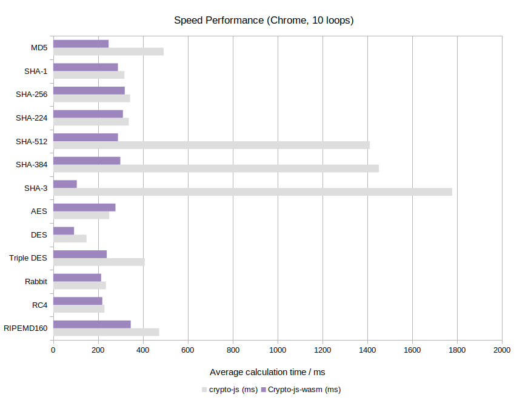
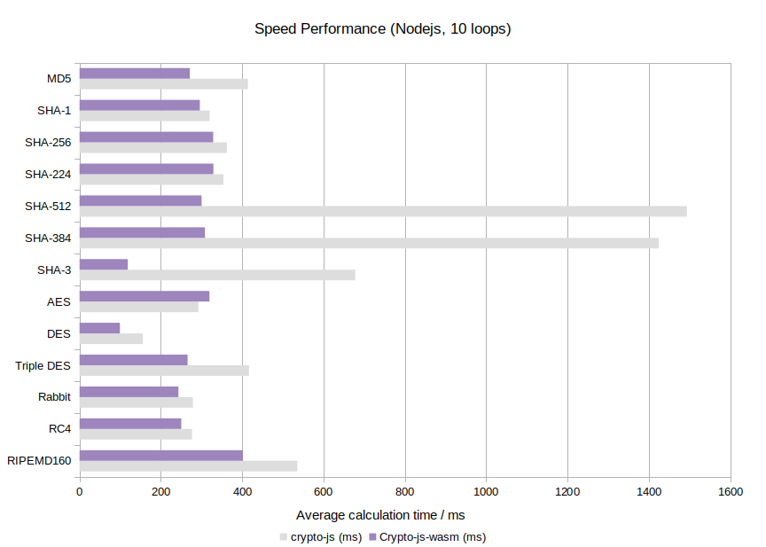

# @originjs/crypto-js-wasm

[English](README.md) | [中文](README-CN.md)

---

`crypto-js-wasm` 是基于 JavaScript 和 [WebAssembly](https://webassembly.org/) 的哈希与加密算法库，其灵感来自于[crypto-js](https://github.com/brix/crypto-js)。

- **安全**: 得益于 WebAssembly ，crypto-js-wasm的计算过程是**不可见、不可中断**的
- **高效**: 相比于crypto-js，计算效率最高提升了16倍(见 [Benchmark](https://originjs.org/WASM-benchmark/#/))
- **兼容crypto-js**: 与crypto-js的API完全相同
- **浏览器 & Nodejs**: 同时支持 `浏览器` 和 `nodejs`
- **全能**: 支持**15+** 以上的哈希和加密算法，包括常用的 MD5、 SHA-x、 AES、RC4等
- **ESM**: 基于ESM语法编写，编译为UMD以保证兼容性


## 安装

```bash
npm install @originjs/crypto-js-wasm
```

或

```bash
pnpm install @originjs/crypto-js-wasm
```

或

```bash
yarn add @originjs/crypto-js-wasm
```


## 使用

在使用各算法前需调用一次对应的`loadWasm()`，或调用`loadAllWasm()`以加载所有算法的WebAssembly文件。

```javascript
import CryptoJSW from 'crypto-js-wasm';

// (可选) 加载所有 wasm 文件
await CryptoJSW.loadAllWasm();

// 通过 Async/Await 语法调用
await CryptoJSW.MD5.loadWasm();
const rstMD5 = CryptoJSW.MD5('message').toString();
console.log(rstMD5);

// 通过 Promise 语法调用
CryptoJSW.SHA256.loadWasm().then(() => {
    const rstSHA256 = CryptoJSW.SHA256('message').toString();
    console.log(rstSHA256);
})
```

需要注意的是，`HMAC` 没有`loadWasm`，因为如果要使用`HMAC`，必须指定哈希（例如`HmacSHA1`）。

同时， `pbkdf2` 中的 `loadWasm` 实现是调用了 `SHA1.loadWasm` ，这是因为 `SHA1` 是 `pbkdf2` 的默认哈希算法。 如果指定了另一个哈希算法，则应分别调用该哈希算法对应的 `loadWasm`。 `evpkdf`/`MD5` 的情况与之类似， `MD5` 是 `evpkdf` 的默认哈希算法。

**RSA使用说明**

请参考[这篇文档](./docs/rsa-CN.md).


**目前可用的算法**

- MD5 / HmacMD5
- SHA1 / HmacSHA1
- SHA224 / HmacSHA224
- SHA256 / HmacSHA256
- SHA384 / HmacSHA384
- SHA512 / HmacSHA512
- SHA3 / HmacSHA3
- RIPEMD160 / HmacRIPEMD160
- PBKDF2
- EvpKDF

<br>

- AES
- Blowfish
- DES
- TripleDES
- Rabbit
- RabbitLegacy
- RC4
- RC4Drop

- RSA


## Benchmark

以下 benchmark 结果运行自一台台式机 (i5-4590, 16 GB RAM, Windows 10 Version 21H2 (OSBuild 19044, 1466))。


*Chrome 102.0.5005.63:*




*Firefox 101.0:*


*Nodejs v16.6.4:*




## 开发

```bash
# 安装依赖
pnpm install

# 生产构建
pnpm run build

# 运行所有测试
pnpm run test

#  运行所有测试并生成测试覆盖率报告
pnpm run coverage
```


#### 为何我们需要调用异步的 loadWasm？

这是因为 WebAssembly 二进制需要通过 `WebAssembly.instantiate` 加载，并且这是一个异步函数。

`WebAssembly.instantiate `与它的同步实现 `WebAssembly.instance` 相比，前者更受推荐；并且，在许多场景下，`WebAssembly.instance` 无法加载不够小的 WebAssembly 二进制。


#### 为何我们需要以base64编码字符的方式，存储wasm二进制？

因为 `crypto-js-wasm` 需要同时支持 `browser` 和 `nodejs` 两种使用场景。相比与 `browser` 中的 `wasm loader` (多数情况下由 webpack, vite 或其他框架提供)以及 `nodejs` 中的 `fs` 方式，这种wasm二进制存储方式是一种相对优雅的方式。


## 版权说明

该项目遵守[木兰宽松许可证](LICENSE)
