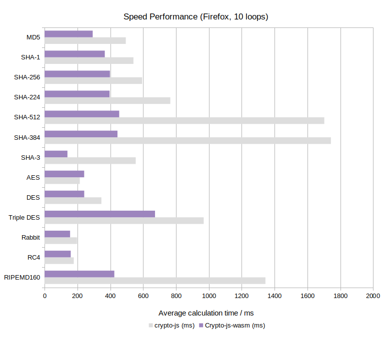

# crypto-js-wasm

[English](README.md) | [中文](README-CN.md)

---

`crypto-js-wasm` is a javascript library of crypto standards. Inspired by [crypto-js](https://github.com/brix/crypto-js), but now powered by [WebAssembly](https://webassembly.org/).

- **Safe**: The process of encryption is fully **enclosed** and **invisible** thanks to WebAssembly.
- **Efficient**: Up to 16x **faster** than crypto-js (see [Benchmark](https://originjs.org/WASM-benchmark/#/)).
- **Browser & Nodejs**: Support both `browser` and `nodejs`.
- **Versatile**: **15+** crypto standards supported, including MD5, SHA-x, AES, RC4, etc.
- **ESM**: Crypto standards can be imported as **ES modules**.


## Getting started

```bash
npm install originjs@crypto-js-wasm
```

or

```bash
pnpm install originjs@crypto-js-wasm
```

or

```bash
yarn add originjs@crypto-js-wasm
```


## Usage

Note that the async function `loadWasm()` should be called once (and once only!) for each algorithm that will be used, unless `loadAllWasm()` is called at the very beginning.


```javascript
import CryptoJSW from 'crypto-js-wasm';

// (Optional) load all wasm files
await CryptoJSW.loadAllWasm();

// Async/Await syntax
await CryptoJSW.MD5.loadWasm();
const rstMD5 = CryptoJSW.MD5('message').toString();
console.log(rstMD5);

// Promise syntax
CryptoJSW.SHA256.loadWasm().then(() => {
    const rstSHA256 = CryptoJSW.SHA256('message').toString();
    console.log(rstSHA256);
})
```


**Available standards**

- MD5 / HmacMD5
- SHA1 / HmacSHA1
- SHA224 / HmacSHA224
- SHA256 / HmacSHA256
- SHA384 / HmacSHA384
- SHA512 / HmacSHA512
- SHA3 / HmacSHA3
- RIPEMD160 / HmacRIPEMD160
- PBKDF2
- EvpKDF

<br>

- AES
- Blowfish
- DES
- TripleDES
- Rabbit
- RabbitLegacy
- RC4
- RC4Drop


**Coming next**

- RSA


## Benchmark

The benchmark below is run on a desktop PC (i5-4590, 16 GB RAM, Windows 10 Version 21H2 (OSBuild 19044, 1466)).


*Chrome 102.0.5005.63:*


*Firefox 101.0:*




*Nodejs v16.6.4:*


## Development

```bash
# install dependencies
pnpm install

# build for production
pnpm run build

# run all tests
pnpm run test

# run all tests with coverage
pnpm run coverage
```


#### Why do we need a async loadWasm call?

This is because the WebAssembly binary needs to be load by `WebAssembly.instantiate`, and it is async. 

The async `WebAssembly.instantiate` is recommended instead of its sync variant `WebAssembly.instance`, and in many cases the `WebAssembly.instance` can not load WebAssembly binary whose size is not small enough.


#### Why do we store wasm binaries in base64-encoded chars?

This is because  `crypto-js-wasm` may be used in `browser` or `nodejs`. This is relative elegant implementation comparing with `wasm loader` in `browser`(powered by webpack, vite or something else) or `fs` in `nodejs`.


## License

Distributed under the [Mulan Permissive Software License](LICENSE)
